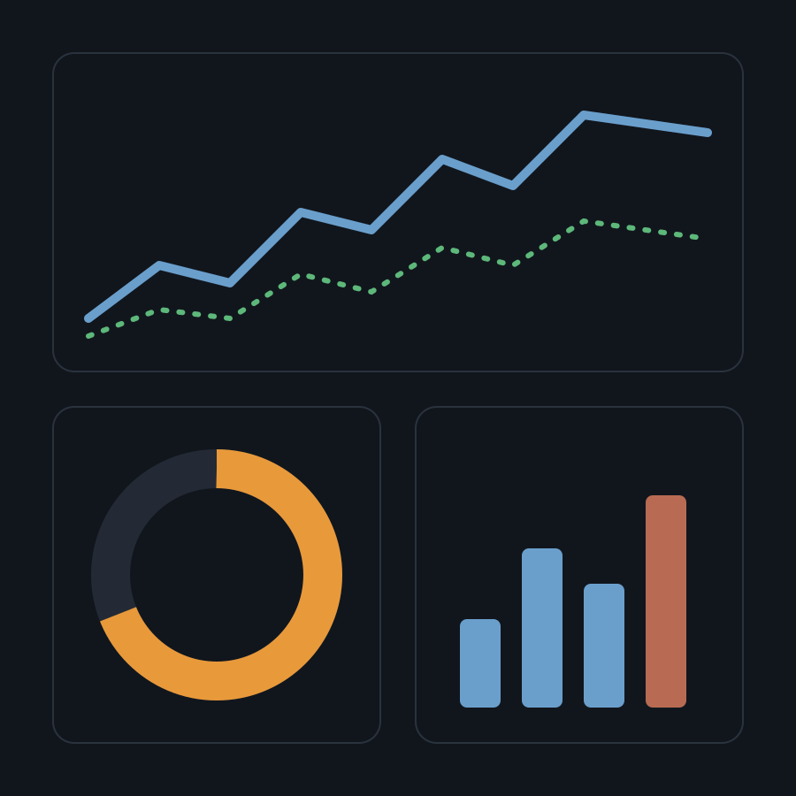

---
<!-- layout: secao -->
# Indicadores

O que os números mostram

---
## Três instrumentos, um sistema

- **PPA** — plano plurianual: diretrizes, objetivos e metas para quatro anos
- **LDO** — lei de diretrizes: prioridades e regras para o exercício seguinte
- **LOA** — lei orçamentária: receitas estimadas e despesas fixadas

::: destaque
Os três instrumentos são leis de iniciativa do Poder Executivo, aprovadas pelo Legislativo.
:::

::: notas
Pergunte à plateia quem já consultou a LOA do próprio estado.
:::

---
<!-- layout: duas-colunas; colunas: 55/45 -->
## Receita e despesa

::: colunas
::: coluna
### Receita
- Estimada, não garantida
- Classificada por natureza e fonte
- Acompanhada mês a mês
:::
::: coluna
### Despesa
- Fixada, com limite máximo
- Classificada por órgão, função e programa
- Executada em três estágios
:::
:::

---
<!-- layout: imagem-lateral -->
## O ciclo em imagem

{.contida}

::: fragmento
- Planejar
- Orçar
- Executar
- Controlar
:::

---
<!-- layout: imagem-fundo -->


# Transparência é método

Dados abertos permitem que a sociedade acompanhe cada etapa.

---
<!-- layout: citacao -->
> A administração pública direta e indireta […] obedecerá aos princípios de legalidade, impessoalidade, moralidade, publicidade e eficiência […].
>
> — Constituição Federal, art. 37

---
## Estágios da despesa

| Estágio | O que significa | Documento |
|---|---|---|
| Empenho | Reserva da dotação para um compromisso | Nota de empenho |
| Liquidação | Verificação do direito do credor | Atesto e medição |
| Pagamento | Entrega do recurso ao credor | Ordem bancária |
{.zebra .destacar-coluna-1}

---
<!-- layout: tabela -->
## Execução por órgão, 2025

```tabela
fonte: execucao_2025.csv
colunas: Órgão, Dotação, Empenhado, Pago
ordenar: Dotação desc
classes: zebra numerica compacta
```

---
## Receita mensal: prevista e arrecadada

```grafico
tipo: linhas
fonte: receita_mensal.csv
rotulos: Mês
series: Prevista, Arrecadada
alternavel: true
titulo: Valores em R$ milhões (fictícios)
```

---
## Maiores dotações

```grafico
tipo: barras
fonte: execucao_2025.csv
rotulos: Órgão
series: Dotação, Empenhado
ordenar: Dotação desc
limite: 6
alternavel: true
```

---
<!-- layout: encerramento -->
# Obrigado

Perguntas, sugestões e correções são bem-vindas.

equipe.exemplo@exemplo.gov.br
